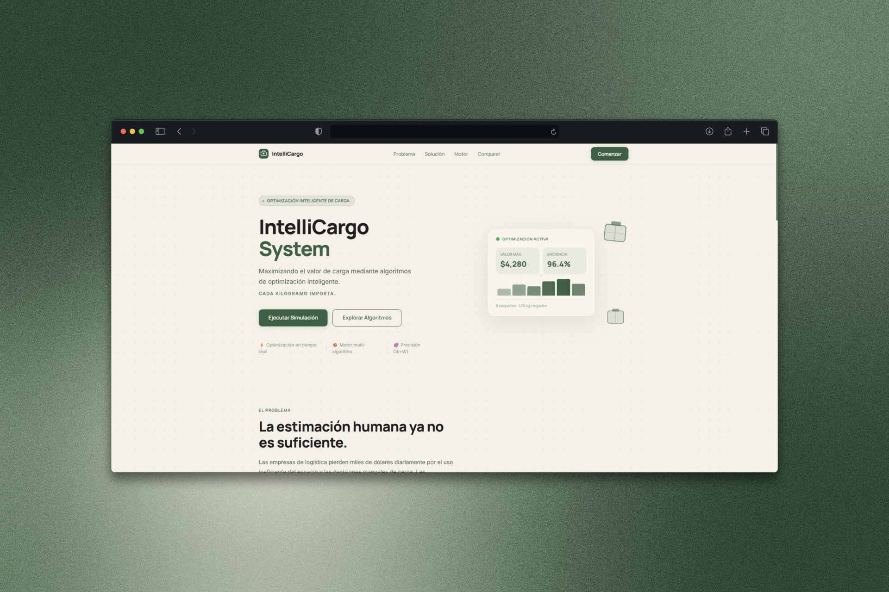

# IntelliCargo
---



---
# 🏗️ Arquitectura del Software

El proyecto implementa un desacoplamiento estricto siguiendo el patrón **N-Capas**, garantizando modularidad, mantenibilidad y facilidad de escalamiento.

Se optó firmemente por el uso del **Patrón Repositorio (Repository Pattern)** para el aislamiento de datos sobre las estructuras tradicionales de acceso directo.

```plaintext
IntelliCargo System/
├── backend/
│   ├── api/
│   │   └── routes.py
│   │       # Controladores y Endpoints de la API REST
│   │
│   ├── core/
│   │   ├── models.py
│   │   │   # Entidades de Dominio (Modelos de Datos)
│   │   │
│   │   └── data_repository.py
│   │       # Capa de Acceso a Datos (Repository Pattern)
│   │
│   ├── data/
│   │   └── packages_mock.json
│   │       # Base de Datos Simulada en formato JSON
│   │
│   ├── services/
│   │   ├── algorithm_service.py
│   │   │   # Núcleo Algorítmico (DP y Greedy)
│   │   │
│   │   └── benchmark_service.py
│   │       # Script de Análisis Asintótico Masivo
│   │
│   └── main.py
│       # Punto de entrada y configuración de FastAPI
│
└── frontend/
    ├── app.js
    │   # Consumo de la API, manejo de estado e integración de Lenis
    │
    └── index.html
        # Landing Page Premium con Tailwind CSS
```

---

#  Núcleo Algorítmico e Impacto de Negocio

El sistema expone de manera visual y cuantitativa un dilema clásico en la optimización logística.

##  Programación Dinámica — Complejidad O(n · W)

Evalúa exhaustivamente la combinación óptima global de paquetes mediante una matriz de estados.

### Beneficios:
- Maximiza la rentabilidad total.
- Evita pérdidas financieras por decisiones subóptimas.
- Garantiza la mejor combinación posible bajo restricciones de peso.

---

##  Algoritmo Voraz (Greedy) — Complejidad O(n log n)

Realiza decisiones rápidas priorizando la relación:

```math
valor / peso
```

### Beneficios:
- Alta velocidad de procesamiento.
- Excelente rendimiento para escenarios en tiempo real.

### Limitaciones:
- Puede quedar atrapado en óptimos locales.
- Tiende a infrautilizar el espacio disponible bajo restricciones estrictas.

---

#  Instalación y Despliegue Local

##  Requisitos Previos

- Python 3.10 o superior
- Navegador moderno compatible con JavaScript ES6+

---

# 1️ Levantar el Servidor Backend (FastAPI)

Abre una terminal y ejecuta:

```bash
# Entrar al backend
cd backend

# Instalar dependencias
pip install fastapi uvicorn pydantic

# Ejecutar servidor
uvicorn main:app --reload
```

El backend se desplegará automáticamente en:

```txt
http://127.0.0.1:8000
```

---

# 2️ Ejecutar Benchmark Algorítmico

Para validar el comportamiento asintótico de los algoritmos con grandes volúmenes de datos:

```bash
# Ejecutar desde backend/
python -m services.benchmark_service
```

El benchmark evalúa escenarios de hasta:

- 1,000 paquetes simultáneos
- Restricciones variables de peso
- Comparación de tiempos entre DP y Greedy

---

# 3️ Lanzar el Frontend

El frontend utiliza:

- Tailwind CSS vía CDN
- Lenis Smooth Scroll
- JavaScript Vanilla Asíncrono

## Pasos:

1. Ir a la carpeta:

```bash
frontend/
```

2. Abrir:

```txt
index.html
```

Puedes usar:
- doble clic
- Live Server de VSCode
- cualquier servidor estático

---

#  Tecnologías Utilizadas

## Backend
- Python
- FastAPI
- Pydantic

## Frontend
- HTML5
- Tailwind CSS
- JavaScript Vanilla (ES6+)
- Lenis Smooth Scroll

## Algoritmos y Optimización
- Programación Dinámica
- Algoritmos Voraces (Greedy)
- Backtracking
- Timsort — O(n log n)

---

#  Objetivo del Proyecto

IntelliCargo busca demostrar cómo la aplicación de algoritmos de optimización puede transformar procesos logísticos tradicionales en sistemas inteligentes capaces de:

- Maximizar ganancias
- Reducir desperdicio de espacio
- Optimizar decisiones de carga
- Mejorar eficiencia operativa

---

#  IntelliCargo

> *"Where logistics meets intelligent optimization."*